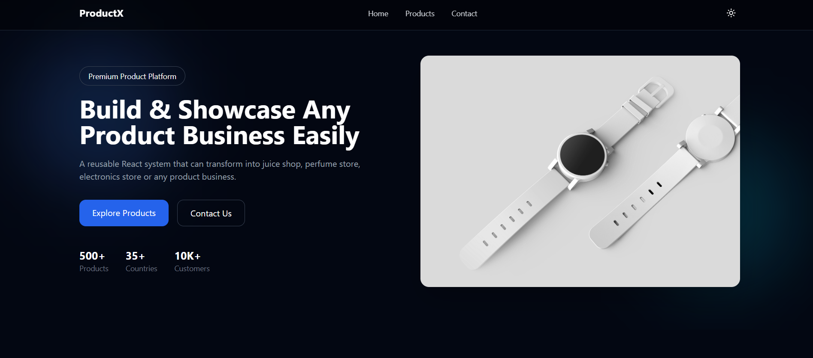
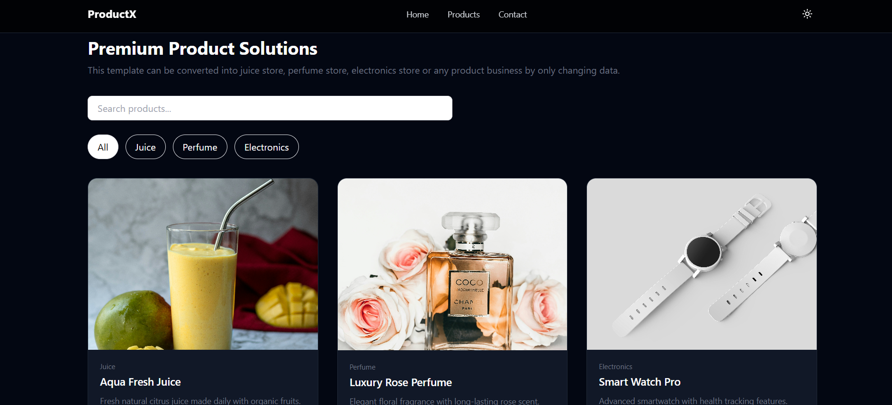
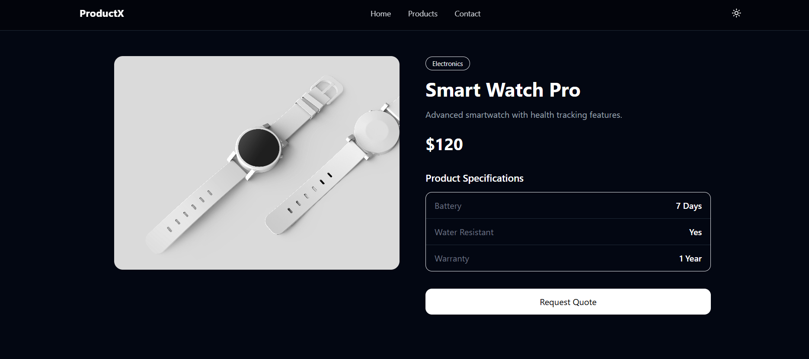
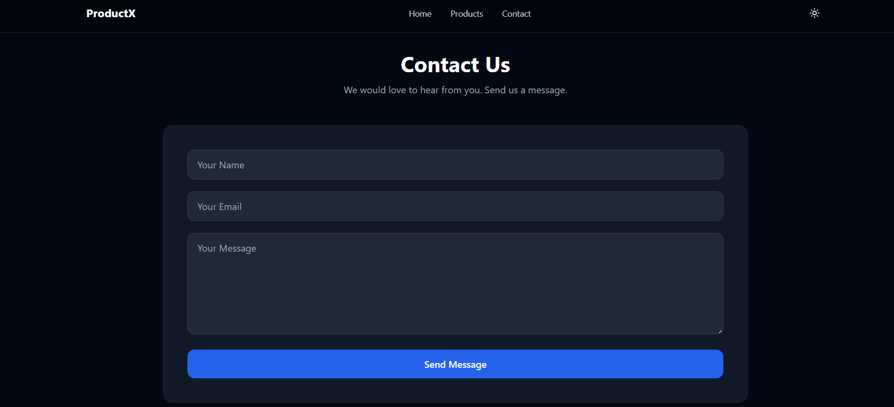

# ProductX - Reusable Product Showcase Website

A modern, responsive product showcase website built with React and Tailwind CSS. This project is designed as a reusable template that can be customized for any product-based business such as juice shops, perfume stores, electronics companies, healthcare products, and more.

## Features

- Responsive design for mobile, tablet, and desktop
- Dark/Light theme support
- Product listing with search and filtering
- Product details page
- Contact form with EmailJS integration
- Modern UI built with Tailwind CSS
- Reusable and scalable architecture
- React Router navigation

## Technologies Used

- React.js
- React Router DOM
- Tailwind CSS
- EmailJS
- Lucide React Icons
- Framer Motion (optional animations)

---

## Live Demo

Demo Link:

https://danu-codes.github.io/product-website/

---

## Screenshots

### Home Page



### Product Listing



### Product Details



### Contact Page


---

## Project Structure

```text
src
│
├── components
│   ├── Navbar.jsx
│   ├── Hero.jsx
│   ├── ProductCard.jsx
│   ├── ProductGrid.jsx 
│   └── Footer.jsx
│
├── pages
│   ├── Home.jsx
│   ├── Products.jsx
│   ├── ProductDetails.jsx
│   ├── Contact.jsx
│   └── About.jsx
│
├── layouts
│   └── MainLayout.jsx
│
├── routes
│   └── AppRoutes.jsx
│
├── context
│   └── ThemeContext.jsx
│
├── config
│   └── siteConfig.js
│
├── data
│   └── products.js
│
├── assets
│
├── App.jsx
├── main.jsx
└── index.css
```

---

## Installation

Clone the repository:

```bash
git clone   "homepage": "https://github.com/danu-codes/product-website.git",

```

Navigate into the project:

```bash
cd product-website
```

Install dependencies:

```bash
npm install
```

Run development server:

```bash
npm run dev
```

Build for production:

```bash
npm run build
```

---

## Customization

This template is designed to be easily adapted to different businesses.

### Update Products

Edit:

```text
src/data/products.js
```

### Update Branding

Edit:

```text
src/config/siteConfig.js
```

Examples:

- Juice Store
- Perfume Store
- Electronics Store
- Healthcare Products
- Industrial Products
- Startup Product Showcase

---

## Contact Form Setup

This project uses EmailJS.

1. Create an EmailJS account
2. Connect Gmail service
3. Create an Email Template
4. Replace:

```js
SERVICE_ID
TEMPLATE_ID
PUBLIC_KEY
```

inside:

```text
src/pages/Contact.jsx
```

---

## Future Improvements

- Product image gallery
- Product reviews
- Advanced filtering
- SEO optimization
- Backend integration
- Admin dashboard

---

## Author

Developed using React and Tailwind CSS.
